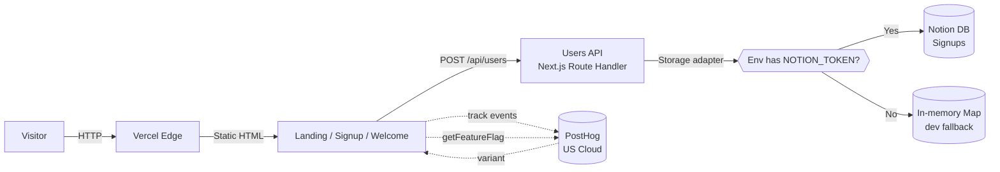

# Architecture

## Overview

FX Replay Growth Engineer challenge — a production-minded marketing experience designed to increase conversion from marketing traffic to free account creation.

**Business objective:** raise CVR of `landing_viewed → signup_succeeded`, specifically for the free tier.

**Narrative bet:** the current fxreplay.com signup flow leaks free-tier conversions because "free" doesn't feel free (Chargebee fires on the free path with checkout language, billing collected before value is delivered, pricing displayed with buggy currency conversion, copy leads with features instead of outcomes). This experience fixes those root causes at the top of the funnel.

## System diagram



## Application structure

```
app/
├── layout.tsx              Root layout — fonts, metadata, JSON-LD, PostHog provider, skip link
├── page.tsx                Landing entry — resolves A/B variant, renders LandingVerbose or LandingMinimal
├── signup/page.tsx         /signup — form + trust panel
├── welcome/page.tsx        /welcome — post-signup confirmation
├── api/users/route.ts      POST + GET users
├── api/users/[id]/route.ts PATCH user
├── icon.svg                Favicon (isotype from brand kit)
├── opengraph-image.tsx     Dynamic 1200×630 OG image
├── sitemap.ts              Sitemap for crawlers
├── robots.ts               robots.txt

components/
├── CtaLink.tsx             Tracked link — fires cta_clicked
├── AnimatedNumber.tsx      Count-up animation on scroll
├── PostHogProvider.tsx     Client PostHog init
├── landing/                Landing pieces: Hero, Features, Assets, FAQ, Footer, StickyCTA, etc.
├── signup/                 SignupForm, SignupViewedTracker
└── welcome/                WelcomeContent

lib/
├── analytics/
│   ├── events.ts           Typed event taxonomy (source of truth)
│   └── track.ts            Wrapper — PostHog or console fallback
├── api/
│   ├── errors.ts           Central error handler + envelope
│   └── schemas.ts          Zod schemas for API payloads
└── storage/
    ├── types.ts            UserStorage interface
    ├── memory.ts           In-memory adapter (dev fallback)
    ├── notion.ts           Notion adapter (production)
    └── index.ts            getStorage() — env-based factory

brand-kit/                  Copied from challenge hand-off (+ tokens.css reconstructed)
public/                     Static assets: favicon, OG image, product feature SVGs, avatars
.claude/                    AI-native workflow — agents, commands, settings
docs/                       This directory
notes/                      Private cheat sheets for the technical review (gitignored)
```

## Major technical decisions

### Framework — Next.js 15 App Router + TypeScript + Tailwind

- SSR/SSG native → good CWV out of the box.
- API routes co-located with UI → no separate backend to deploy.
- Vercel deploys in one click.
- Match with what FX Replay likely uses.

### Persistence — Storage adapter pattern

Two implementations behind a single `UserStorage` interface:

- `NotionStorage` (production) — writes to a Notion database via `@notionhq/client`.
- `InMemoryStorage` (dev fallback) — module-level `Map`, resets on cold start.

Selection at boot (in `lib/storage/index.ts`):

```ts
export function getStorage(): UserStorage {
  const token = process.env.NOTION_TOKEN
  const dbId = process.env.NOTION_SIGNUPS_DB_ID
  if (token && dbId) return new NotionStorage(token, dbId)
  return new InMemoryStorage()
}
```

**Rationale:** the reviewer can `git clone && npm run dev` without credentials — the app falls back to in-memory and every feature still works. In production (Vercel) with the env vars set, the same code writes to a real Notion database. This is the difference between a clone-and-explore experience and a "please set up 3 services first" experience.

### Analytics — PostHog with typed taxonomy + fallback

- Single tool covers events, funnels, and feature flags (used by the A/B experiment).
- `lib/analytics/events.ts` defines the `Events` type as the single source of truth — invalid event names or malformed props fail at compile time.
- `lib/analytics/track.ts` wraps PostHog with a console.log fallback for local dev without a PostHog key.
- Autocapture, session replay, and automatic pageviews are all **off** — we emit semantic events explicitly so funnels stay precise.
- Detail: [analytics.md](./analytics.md).

### A/B experiment — PostHog feature flag + variant switch

- Flag `landing_density` (multivariate: `control` / `variant_a`, 50/50 split).
- `app/page.tsx` reads the flag client-side via `getVariant()`, renders `<LandingVerbose />` or `<LandingMinimal />`.
- URL-param override (`?v=variant_a`) for preview/QA without touching PostHog.
- Both variants ship the same header, footer, signup flow, and analytics — only the landing composition differs.
- Detail: [experiment.md](./experiment.md).

### API design — REST-ish with Zod validation and typed error envelope

Endpoints:

| Method | Path | Purpose |
|---|---|---|
| POST | `/api/users` | Create a user (201 on success) |
| GET  | `/api/users` | List users (cursor-paginated) |
| PATCH | `/api/users/[id]` | Partial update |

**Error envelope** (`lib/api/errors.ts`):

```json
{ "error": { "code": "email_already_exists", "message": "…", "details": null } }
```

Consistent codes let the frontend distinguish `email_already_exists` (user-friendly inline error) from `internal_error` (generic retry prompt).

Validation via Zod (`lib/api/schemas.ts`) — any drift between docs and code fails compile.

### Rendering strategy

- Landing, signup, welcome all pre-rendered statically (`○` in `next build` output).
- API routes are dynamic (`ƒ`) — expected.
- The current `app/page.tsx` is client-side rendered due to the PostHog flag resolution — trade-off documented in [trade-offs.md](./trade-offs.md) with the fix path (server-side variant resolution via cookie bootstrap).

## Deployment architecture

**Target:** Vercel.

- Push to `main` → Vercel builds and deploys automatically.
- Env vars set in Vercel dashboard: `NOTION_TOKEN`, `NOTION_SIGNUPS_DB_ID`, `NEXT_PUBLIC_POSTHOG_KEY`, `NEXT_PUBLIC_POSTHOG_HOST`, `NEXT_PUBLIC_SITE_URL`.
- Preview deploys on every PR (would let us diff visual changes before merging).

**Vercel Edge Network** serves static pages from the CDN region closest to the user. API routes run on serverless functions (Node runtime for compatibility with `@notionhq/client`; `opengraph-image.tsx` uses the `edge` runtime for lower latency).

## Infrastructure considerations

- **DNS:** Vercel-provided subdomain for the challenge; custom domain wired via CNAME in production.
- **CDN / edge:** Vercel Edge Network by default. Static assets (SVGs, PNG avatars, OG image) served from CDN with immutable cache headers.
- **Caching:** default Next.js static cache; `Cache-Control` on OG image tuned separately.
- **Observability (production would add):** Sentry for runtime errors + Vercel Analytics for CWV + PostHog for product analytics (already wired).
- **Security:** no PII stored in PostHog (only opaque `user_id`); Notion token scoped to a single database via integration capabilities (read + insert + update only, no delete); environment variables never client-exposed unless prefixed `NEXT_PUBLIC_`.
- **Reliability:** the adapter pattern means the app degrades gracefully — if Notion is down, signups could be batched to a fallback queue in a future iteration (not implemented for this scope).

## What would change if this became a production FX Replay system

Ranked by impact:

1. **Replace Notion with Postgres** (Supabase or Neon). Notion has rate limits, slow list queries, no real indexing, and no schema migrations. Fine for the challenge as an evidence-of-integration story; wrong for millions of signups per month.
2. **Real authentication** (NextAuth + email verification + password reset + session persistence). The current signup is simulated — creates a Notion row but does not persist a session.
3. **Server-side variant resolution** for the A/B test (PostHog `bootstrap` from cookies). Eliminates the client-side flash and lets `app/page.tsx` return to a server component.
4. **Server-driven feature flags** for all critical CTAs (currently `variant` is hardcoded `control` in some `cta_clicked` calls — see [trade-offs.md](./trade-offs.md)).
5. **Rate limiting** at the API layer (Vercel middleware or Cloudflare WAF) to prevent signup abuse.
6. **Sentry + Datadog RUM** for runtime error tracking + real-user monitoring beyond CWV.
7. **A11y audit at CI** — axe-core in Playwright, run on every PR.
8. **Retry queue for analytics events** (service worker + IndexedDB) — currently a PostHog outage drops events on the floor.
9. **Consent management** (Cookiebot or similar) if the audience includes EU users.
10. **Automated tests** — unit tests for the storage adapter contract, E2E tests for the signup flow via Playwright.
